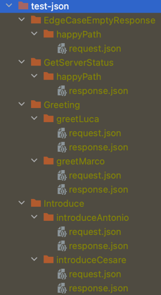

## Overview

The goal of this repository is to showcase how to create, automatically, an OpenAPI3 documentation of gRPC methods
mapped to REST endpoints.<br>
It is achieved through 4 scripts, which we will go in more detail later. For now, as an overview, be aware that running
these scripts does the following:

1. Generate a Swagger2 from the proto file using the OpenApiv2 `buf` dependency
2. Convert the Swagger2 to OpenAPI3 by calling a REST endpoint exposed by `swagger.io`
3. Extract from the proto file the rpc method name, the HTTP verb and the URL of each RPC method mapped to a REST
   endpoint
4. Add to the OpenAPI3 file created in step #2 request and response samples, taking them from the GrpcServer unit test
   class. This is obtained through a small library (more on this later).

## The gRPC Endpoints

This repository contains a basic gRPC server with four endpoints: `GetServerStatus`,`Greeting`, `Introduce`
and `EdgeCaseEmptyResponse`. <br>
Each is mapped to a REST endpoint.

## About the scripts

The project contains a folder named `scripts`. Inside, we can find four scripts:

1. `master_script`: the single script to be manually executed, which orchestrates the whole flow. It uses `buf` to
   generate a basic swagger2 file in `api/src/main/gen/openapiv2/proto/v1/grpc_server_proto.swagger.json` by reading the
   proto file. It also calls the other scripts.
2. `convert_swagger2_to_openapi3.sh`: a bash script that performs a REST call to an external endpoint to convert a
   Swagger2 to OpenAPI3
3. `extract_endpoint_info_from_proto.kts`: a kotlin script that, given a proto file, generates a `.txt` file that
   contains `rpc method name`, `URL`, `http verb` for each gRPC endpoint. <br>
   This script has two <span style="color:red">constraints</span>: the google `option` to define the REST endpoint *
   *MUST** be defined as follows (multi-line):

```
option (google.api.http) = {
  post: "/service/greeting",
  body: "*"
};
```

The following (single line) is NOT valid and will result in an error:

```
option (google.api.http) = { post: "/service/greeting", body: "*" };
```

The second constraint regards spacing between the name of the RPC method and the request body.
In fact, between these, there MUST be a space to separate the two. Hence, the following is not valid:

```
Greeting(GreetingRequest)
```

> I am quite confident these two constraint can be easily fixed in future improvements of these scripts

4. `add_examples_to_openapi.sh`: a bash script that reads from the file previously generated at step#3 and for each
   line (each endpoint), automatically adds the request and responses to the OpenAPI3 file. The requests and responses
   are automatically generated by the library explained earlier.

### The Outcome of running the scripts

The outcome of running `master_script.sh` is the file located at `api/src/main/gen/openapiv3/openapi.json`, which will
be an OpenAPI3 file specification of our gRPC methods with request and response examples.
> Please note, only the RPC methods with the option `google.api.http` will be reported in the openapi3 file.

## About the Library to autogenerate request and response samples in JSON format from GrpcServerTest unit tests

The JSON files produced by the library are organized in a tidy approach:

* Each unit test method annotated with `@WriteGrpcRequestAndResponseAsJsonToFile`, will produce a `request.json` (if the
  endpoint is not a GET or such) file and `response.json` file (if the response isn't `google.protobuf.Empty`)
* Each `request.json` and `response.json` files are stored in folders named after the nested test classes to which the
  unit test method is related (`GetServerStatus`, `Greeting`, `Introduce`, etc).
* Finally, all these folders are placed under the root directory `service/target/test_json`.

To see how this works, look at the `GrpcServer` and `GrpcServerTest` classes. Inside `GrpcServerTest`, you'll find 4
nested classes, one for each gRPC endpoint.
Using nested classes like this helps keep the code well-organized and easy to read. Moreover, it's a requirement for the
library to work properly.<br>
The names of these nested classes are used to create folders within `service/target/test_json`. <br>
Inside these folders, you'll find the JSON files that represent the gRPC request and response bodies for each test. The
filenames match the names of the tests.

Below is a sample screenshot showing the outcome of running the `GrpcServerTest` class:



Let's analyze a portion of the screenshot:

* `Greeting` - name of the nested class which represents a gRPC endpoint
    * `greetLuca` - name of the test method (within the `Greeting` nested class)
      *` request.json` - the json file containing the gRPC request
      *` response.json` - the json file containing the gRPC response
    * `greetMarco` - name of the test method (within the Greeting nested class)
* `Introduce` - name of the nested class which represents a gRPC endpoint
  and so on.

## How it works

The code is located in the
folder `service/src/test/com.marcofaccani.grpc.server.automatic.opneapi.documentation.generation.library`.
It is made of two classes, `WriteGrpcRequestAsJsonToFile` and `GrpcRequestJsonExtension`.

### WriteGrpcRequestAsJsonToFile

This is just an annotation at a method-level. It shall be used to annotate the methods within the GrpcServerTest class
that you intend to generate JSON files for.

### GrpcRequestJsonExtension

This is where the core logic is located.
It is executed after the test has run and in case of errors, it is free from side effects, logging a warning with the
name of the method for which the JSON file generation didn't work out.
It does three major things:

1. retrieve a reference to the gRPC request
2. creates the subfolder named as the nested class itself (if it's not already present)
3. writes the gRPC request as JSON to a file within the potentially previously created class.

In order for this logic to work properly, there are two "<span style="color:red">constraints</span>":

1. the gRPC request field, as well as the grpc response field, **_MUST_** be named as such, `grpcRequest`
   and `grpcResponse`.
2. within the nested test class (contained by the `GrpcServerTest` class) we must define the gRPC request and the gRPC
   response at nested-class level.
   Hence, rather than doing the following:

```
@Nested
class Greeting {
  
  [...]

  @Test
  @WriteGrpcRequestAsJsonToFile
  void greetMarco() {
    // the gRPC request is declered and initialized within the test method
    final var grpcRequest = TestData.buildGrpcRequest();
    assertDoesNotThrow(() -> underTest.greeting(grpcRequest, streamObserver));
    verify(streamObserver).onNext(TestData.buildGrpcResponse());

  }
}
```

We must do like this:

```
@Nested
class Greeting {

  GreetingRequest grpcRequest;  // <-- it's declered here
  GreetingResponse grpcResponse;  // <-- it's declered here

  
  [...]

  @Test
  @WriteGrpcRequestAsJsonToFile
  void greetMarco() {
    grpcRequest = TestData.buildGrpcRequest(); // <-- it's initialized here
    assertDoesNotThrow(() -> underTest.greeting(grpcRequest, streamObserver));
    grpcResponse = TestData.buildGrpcResponse();
    verify(streamObserver).onNext(grpcResponse);
  }
}
```

### External Dependencies

To avoid `InvalidDefinitionException: Direct self-reference leading to cycle` we need `protobuf-jackson`.
This is because the traditional Jackson attempts to serialise gRPC internal fields that contain cyclic or
non-serializable references.
Protobuf-jackson is used within the constructor of `GrpcRequestJsonExtension`, as follows:

```
public GrpcRequestJsonExtension() {
    mapper = new ObjectMapper();
    mapper.registerModule(new ProtobufModule());
}
```
